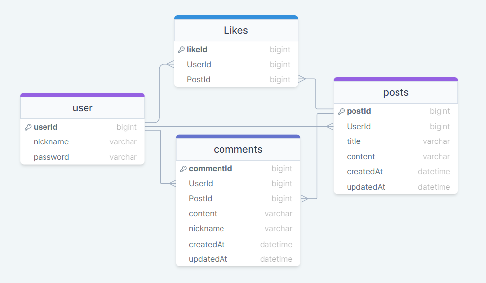

### ERD

---

## 

### 전체 폴더 구조

---

```
nodeSoloProj-4
├─ middlewares
│ └─ auth-middleware.js
├─ migrations
│ ├─ 20230627004208-create-user.js
│ ├─ 20230627010653-create-posts.js
│ ├─ 20230707014104-create-comments.js
│ └─ 20230707061729-create-likes.js
├─ models
│ ├─ comments.js
│ ├─ index.js
│ ├─ likes.js
│ ├─ posts.js
│ └─ user.js
├─ routes
│ ├─ auth.js
│ ├─ comments.js
│ ├─ like.js
│ ├─ post.js
│ └─ user.js
├─ .gitignore
├─ app.js
├─ image.png
├─ package-lock.json
├─ package.json
└─ README.md
```
